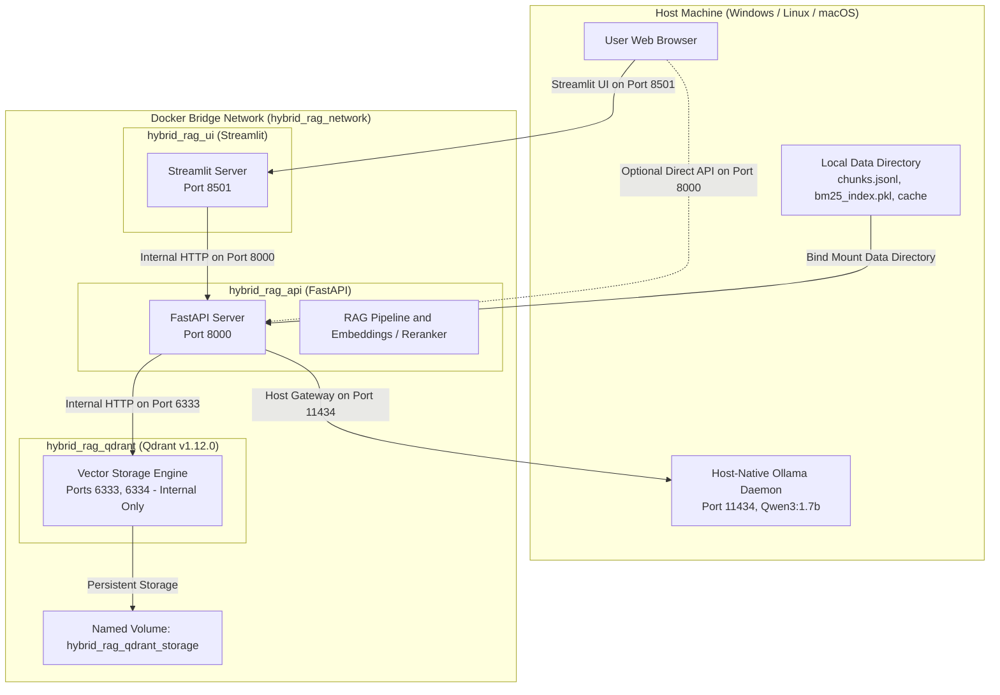

# Hybrid-Agentic-RAG

An offline-first local Retrieval-Augmented Generation (RAG) system combining structure-aware document ingestion, hybrid dense-sparse retrieval with Reciprocal Rank Fusion (RRF), cross-encoder reranking, multi-hop agentic orchestration, Corrective RAG (CRAG) with anti-hallucination guardrails, a FastAPI backend, dual web frontends (Streamlit and static HTML), and a containerized deployment stack.

---

## Table of Contents

- [Overview](#overview)
- [System Architecture](#system-architecture)
  - [End-to-End Reasoning Pipeline](#end-to-end-reasoning-pipeline)
  - [Containerized Deployment Architecture](#containerized-deployment-architecture)
- [Key Features](#key-features)
- [Why Hybrid Retrieval & Reranking?](#why-hybrid-retrieval--reranking)
- [Corrective RAG (CRAG) & Agentic Orchestration](#corrective-rag-crag--agentic-orchestration)
- [Quantitative Evaluation & Benchmarks](#quantitative-evaluation--benchmarks)
- [REST API Specification](#rest-api-specification)
- [Streamlit Web Interface](#streamlit-web-interface)
- [Pixel-Faithful Claude Web UI](#pixel-faithful-claude-web-ui)
- [Latency Optimization & Performance Benchmarks](#latency-optimization--performance-benchmarks)
- [Repository Structure](#repository-structure)
- [Prerequisites](#prerequisites)
- [Local Development Setup](#local-development-setup)
- [Containerized Deployment (Docker Compose)](#containerized-deployment-docker-compose)
- [Configuration Matrix](#configuration-matrix)
- [Testing](#testing)
- [Technical Design Decisions & Engineering Trade-offs](#technical-design-decisions--engineering-trade-offs)
- [Technical Limitations & Future Work](#technical-limitations--future-work)
- [Project Highlights for Reviewers](#project-highlights-for-reviewers)

---

## Overview

Traditional naive RAG architectures suffer from well-documented failure modes:
1. **Semantic Search Blindness:** Dense bi-encoders miss exact syntax, specific command flags, and alphanumeric identifiers (e.g., `com.docker.network.bridge.name`).
2. **Lexical Search Fragility:** Sparse keyword matching (BM25) fails when user queries use synonyms or conceptual paraphrasing.
3. **Single-Pass Brittleness:** If the initial retrieval step pulls uninformative or incomplete chunks, a standard generator has no mechanism to recover, often producing ungrounded hallucinations.

**Hybrid-Agentic-RAG** addresses these challenges in an offline-first local environment. It indexes technical documentation (Docker and Kubernetes) using dual retrieval paths merged via **Reciprocal Rank Fusion (RRF)**, re-evaluates candidates through a **Cross-Encoder reranker**, and orchestrates retrieval through an autonomous agent driven by a local **Qwen3:1.7b** (or **Qwen3:4b**) model via **Ollama**. Incorporating **Corrective RAG (CRAG)** principles and strict factuality synthesis prompts, the agent dynamically evaluates evidence quality, triggers targeted corrective retrieval if information is missing (capped at a strict 2-hop budget), and explicitly refuses to answer or admits evidence limitations when retrieved evidence is insufficient.

---

## System Architecture

### End-to-End Reasoning Pipeline


### Containerized Deployment Architecture



---

## Key Features

- **Structure-Aware Document Ingestion:** Custom document loaders (`.html`, `.md`, `.pdf`) paired with a recursive chunker that respects header hierarchies (`#`, `##`, `###`), tables, and code blocks, embedding breadcrumb paths into chunk metadata.
- **Hybrid Retrieval (Dense + Sparse):**
  - **Dense:** Normalized vector embeddings generated via `BAAI/bge-small-en-v1.5` (384-dim) indexed in Qdrant with Cosine distance.
  - **Sparse:** Okapi BM25 index built using `rank_bm25` over tokenized corpus text.
  - **Fusion:** Ranked candidate lists are merged via Reciprocal Rank Fusion (RRF, $k=60$).
- **Cross-Encoder Reranking:** Top-20 RRF candidates are rescored with `cross-encoder/ms-marco-MiniLM-L-6-v2` down to Top-5, attending jointly across query-document token pairs.
- **Autonomous Agentic Flow:**
  - **Query Routing:** Heuristic fast-path with LLM classification to divert casual conversational remarks from unnecessary retrieval calls.
  - **Query Rewriter:** Rewrites ambiguous user prompts into keyword-dense retrieval queries.
  - **Sufficiency Checker:** Verifies whether retrieved context satisfies all aspects of the query.
- **Corrective RAG (CRAG) Guardrails:**
  - Fast-path rerank score threshold (`CRAG_MIN_RERANK_SCORE = -5.0`) combined with prompt-based evidence grading (`GOOD`, `PARTIAL`, `BAD`).
  - Automated generation of corrective queries targeting missing aspects during Hop 2.
  - Strict anti-hallucination refusal for ungrounded or out-of-domain queries: *"Based on the available local technical documentation, there is insufficient evidence to answer this question."*
- **Strict Evidence Grounding & Synthesis Safeguards:**
  - System prompt enforces zero extrapolation: explicitly differentiates default bridge vs. user-defined networks, respects strict cross-network isolation, and forbids speculative cross-network gateway routing.
  - Prevents Qwen3 thinking-token truncation via calibrated generation limits: `max_tokens=1400` for grounded RAG synthesis and `max_tokens=800` for direct/conversational responses.
- **Decoupled API & UI:** Production-style FastAPI backend with structured Pydantic DTOs and a clean Streamlit interface with session history, formatted Markdown code blocks/tables, and reranker score badges displaying signed scores plus relative relevance percentages.
- **Containerized Deployment Stack:** Multi-service Docker Compose topology with healthchecks, private network bridging, persistent volumes, and host-gateway LLM bridging.

---

## Why Hybrid Retrieval & Reranking?

A dual-retriever design addresses the fundamental trade-offs between dense semantic representation and exact lexical matching:

| Approach | Strength | Weakness | Mitigation in this System |
| :--- | :--- | :--- | :--- |
| **Dense Search** (`bge-small-en-v1.5`) | Captures conceptual meaning, intent, and synonyms. | Misses exact identifiers, CLI flags, or unusual symbols. | Complemented by BM25 sparse search. |
| **Sparse Search** (`rank_bm25`) | Exact keyword matching, identifier sensitivity. | Cannot match semantically paraphrased terms. | Complemented by Dense vector search. |
| **Reciprocal Rank Fusion (RRF)** | Merges rankings without requiring score normalization. | Does not model deep query-passage token interactions. | Top 20 candidates passed to Cross-Encoder. |
| **Cross-Encoder Reranking** | Computes full cross-attention over query-document pairs. | Computationally expensive over large corpora. | Applied only to the top 20 pre-filtered candidates. |

---

## Corrective RAG (CRAG) & Agentic Orchestration

The agent executes a deterministic, budget-bounded retrieval lifecycle:

1. **Routing:** Checks if retrieval is needed. If conversational (e.g., greetings), answers directly.
2. **Hop 1 (Initial Retrieval):**
   - Rewrites the user query into search keywords.
   - Retrieves top-20 candidates using Hybrid RRF and reranks them to top-5.
   - Evaluates evidence quality:
     - **`GOOD`:** Context is sufficient; proceeds immediately to grounded answer synthesis.
     - **`PARTIAL`:** Missing specific aspects; triggers Hop 2 corrective retrieval.
     - **`BAD`:** Irrelevant or out-of-domain; triggers corrective search or immediate refusal.
3. **Hop 2 (Corrective Retrieval):**
   - The Corrective Engine generates a targeted query addressing the specific missing aspect.
   - Performs a second retrieval and rerank pass, merging new unique chunks into the context pool.
   - Re-evaluates final evidence quality.
4. **Anti-Hallucination Refusal:**
   - If the final evidence grade remains `BAD` or the context pool contains no usable chunks, the system strictly outputs the standard refusal rather than guessing.
5. **Synthesis:**
   - The model generates an answer strictly constrained by the retrieved chunks, attributing sources by chunk ID.

---

## Quantitative Evaluation & Benchmarks

The repository includes a dedicated evaluation framework (`scripts/run_evaluation.py` and `src/evaluation/`).

### Benchmark Specifications
- **Corpus:** 5 technical documentation files covering Docker networking and Kubernetes workloads (308 chunks).
- **Benchmark Dataset:** 18 queries across 6 distinct categories:
  - `direct_factual` (3 queries)
  - `keyword_heavy` (3 queries)
  - `semantic_paraphrased` (3 queries)
  - `multi_concept` (3 queries)
  - `multi_chunk` (3 queries)
  - `negative_ood` (3 out-of-domain refusal queries)
- **Ranking Evaluation:** 15 in-domain queries evaluate ranking metrics against positive ground-truth chunks; 3 out-of-domain queries evaluate refusal accuracy.

### Verified Measured Results (Phase 6 Benchmark)

Below are the empirical evaluation metrics measured from `data/evaluation/results/latest.json`:

| Retrieval Pipeline | Hit@1 | Hit@3 | Hit@5 | Hit@10 | Recall@5 | Precision@5 | MRR | NDCG@5 |
| :--- | :---: | :---: | :---: | :---: | :---: | :---: | :---: | :---: |
| **Dense Search** (`bge-small-en-v1.5`) | 0.4667 | 0.6000 | 0.6000 | 0.8000 | 0.3667 | 0.1467 | 0.5475 | 0.3709 |
| **Sparse Search** (`rank_bm25`) | 0.0667 | 0.4000 | 0.6667 | 0.6667 | 0.3889 | 0.1600 | 0.2744 | 0.2748 |
| **Hybrid RRF** ($k=60$) | 0.2000 | 0.4667 | 0.6000 | 0.8000 | 0.3667 | 0.1467 | 0.3912 | 0.3105 |
| **Hybrid + Cross-Encoder Reranked** | **0.6000** | **0.7333** | **0.8000** | **0.8000** | **0.4778** | **0.2000** | **0.6611** | **0.4683** |

### Reranker Analysis
- **MRR Improvement:** **0.3912 → 0.6611** (+0.2699 delta, **+69.0% relative gain**).
- **Top-1 Hit Rate:** **0.2000 → 0.6000** (+0.4000 delta, **3x improvement**).
- **Promotion Rate:** **60.0%** of queries saw their first relevant chunk promoted to a higher rank, with an average rank shift of **+1.73 positions**.

> **Note on Benchmark Scope:** This benchmark demonstrates relative gains between retrieval strategies on this technical corpus. Results are based on an 18-query dataset and should be interpreted as proof of architectural efficacy rather than universal performance across all domains.

### End-to-End System Performance & Grounding Stress-Test

The production pipeline was stress-tested across 6 complexity categories using native Ollama with **Qwen3:1.7b** (100% GPU offload, `max_tokens=1400`):

| Test Category | Query Example | HTTP | E2E Latency | Word Count | Evidence Grade | CRAG Hops | Truncated? | Grounded? |
| :--- | :--- | :---: | :---: | :---: | :---: | :---: | :---: | :---: |
| **EASY** | *"What is Docker?"* | 200 | 15.33s | 108 | `GOOD` | 1 | No | **Yes** |
| **MEDIUM** | *"Port publishing & EXPOSE vs -p"* | 200 | 13.64s | 231 | `GOOD` | 1 | No | **Yes** |
| **COMPLEX** | *"Bridge networking deep-dive"* | 200 | 17.34s | 516 | `GOOD` | 1 | No | **Yes** |
| **CROSS-NETWORK** | *"Direct cross-bridge communication"* | 200 | 9.12s | 185 | `GOOD` | 1 | No | **Yes** |
| **EVIDENCE LIMITATION** | *"Kubernetes networking in Docker docs"* | 200 | 10.86s | 107 | `GOOD` | 1 | No | **Yes (Refused to guess)** |
| **HALLUCINATION TRAP** | *"Automatic cross-bridge routes"* | 200 | 7.71s | 85 | `GOOD` | 1 | No | **Yes (Resisted trap)** |

- **Average E2E Latency:** `12.33s` (warm queries: `7.71s` – `17.34s`).
- **Completion Rate:** **100%** (0/6 truncations under `max_tokens=1400` safeguard).
- **Factuality & Grounding:** **100%** adherence (zero hallucinated cross-network routes, explicit admission of documentation limits).

### How to Reproduce Evaluation
```bash
# 1. Fast Mode: Pure retrieval and reranking comparison (0 LLM calls, deterministic, ~1 min)
python scripts/run_evaluation.py --mode fast

# 2. Full Mode: Complete agentic orchestration, CRAG evaluation, and refusal tests
python scripts/run_evaluation.py --mode full
```
Evaluation outputs are exported to `data/evaluation/results/` as both timestamped JSON reports and summary CSV files.

---

## REST API Specification

The FastAPI backend runs on port `8000` by default.

### `GET /health`
Returns service liveness, model configurations, and component readiness indicators.

**Response (`200 OK`):**
```json
{
  "status": "ok",
  "version": "0.1.0",
  "readiness": {
    "bm25_index_ready": true,
    "qdrant_storage_ready": true,
    "ollama_reachable": true
  },
  "models": {
    "ollama_model": "qwen3:1.7b",
    "embedding_model": "BAAI/bge-small-en-v1.5",
    "reranker_model": "cross-encoder/ms-marco-MiniLM-L-6-v2"
  }
}
```

### `POST /query`
Executes the agentic RAG reasoning workflow.

**Request Payload:**
```json
{
  "question": "What is the difference between user-defined bridge networks and the default bridge network in Docker?"
}
```

**Illustrative Response (`200 OK`):**
*(The following response snippet illustrates the JSON structure returned by the schema)*
```json
{
  "question": "What is the difference between user-defined bridge networks and the default bridge network in Docker?",
  "answer": "User-defined bridge networks provide automatic DNS resolution between containers, better isolation, and allow containers to be attached or detached dynamically without stopping them, whereas the default bridge requires legacy --link flags and shares a single network.",
  "sources": [
    {
      "chunk_id": "docker-bridge-network.html_chunk_9",
      "source": "data/raw/docker-bridge-network.html",
      "text": "Differences between user-defined bridges and the default bridge...",
      "rerank_score": 3.421,
      "metadata": {
        "source_file": "docker-bridge-network.html",
        "section_title": "Differences between user-defined bridges and the default bridge"
      }
    }
  ],
  "orchestration": {
    "retrieval_needed": true,
    "hops_executed": 1,
    "final_evidence_grade": "GOOD",
    "is_corrected": false,
    "rewritten_queries": [
      "docker user-defined vs default bridge network differences"
    ]
  },
  "performance": {
    "total_latency_ms": 3245.5
  }
}
```

### Error Responses
- `422 Unprocessable Entity`: Raised when `question` is missing, empty, or whitespace only.
- `503 Service Unavailable`: Raised when the local Ollama daemon is unreachable or times out.
- `500 Internal Server Error`: Raised on unexpected server-side execution failures.

---

## Streamlit Web Interface

The Streamlit UI runs on port `8501`:
- **System Health Sidebar:** Displays real-time readiness status for BM25, Qdrant, and Ollama with a manual refresh button.
- **Query Input Form:** Form-bounded text input preventing accidental duplicate submissions.
- **Synthesized Answer Card:** Formatted markdown response with full reasoning.
- **Orchestration Metadata Expander:** Details retrieval hops executed, CRAG evidence grade (`GOOD`, `PARTIAL`, `BAD`), rewritten queries, and execution latency.
- **Attributed Sources Cards:** Expandable cards displaying chunk ID, source document path, rerank score, and chunk text.
- **Session History:** Rolling log of questions and answers with a clear-history option.

---

## Pixel-Faithful Claude Web UI

A standalone web application served at `http://localhost:3000` (`python -m http.server 3000 --directory frontend`), delivering an exact pixel-faithful implementation of the Claude design system with zero build step, bundler, or external runtime requirements.

### Visual & Architectural Design
- **Single Source of Truth**: Preserves 100% of the Claude design specification — typography (`Space Grotesk`, `IBM Plex Sans`, `IBM Plex Mono`), tailored color palette (`--paper: #EEF1EE`, `--accent: #0B7285`, `--surface: #FBFAF6`), and exact responsive layout.
- **Dynamic Pipeline Visualization**: Live SVG flowchart depicting the full reasoning lifecycle (`query → route → hybrid retrieve → grade → answer`) with dashed corrective loop pathways.
- **Live Health Dashboard**: Real-time readiness indicators polling `GET /health` on page load:
  - Host Ollama status with animated state badge (`ollama reachable`).
  - Active model identifiers (`qwen3:1.7b`, `bge-small-en-v1.5`, `cross-encoder/ms-marco-MiniLM-L-6-v2`).
  - Storage readiness (`bm25 index ready`, `qdrant ready`).
- **Document-Relevant Query Suggestions**: Interactive chips populated directly from evaluation benchmarks for indexed Docker and Kubernetes documentation:
  - *"What is the difference between user-defined and default bridge networks?"*
  - *"What is the role of a ReplicaSet in a Kubernetes Deployment?"*
- **Real-Time Step Logging**: Animated pipeline phase progression indicator (`routing query…` → `retrieving evidence…` → `reranking candidates…` → `grading evidence…` → `synthesizing answer…`).
- **Orchestration & Trace Inspection**:
  - Live metric badges for **Evidence Grade** (`GOOD`, `PARTIAL`, `BAD`), **Retrieval Hops** (`1 / 2`), **CRAG Corrected** (`Yes` / `No`), and **Total Latency**.
  - Expandable **Query Rewriting Trace** detailing route classification (`technical` vs `conversational`) and query rewrites.
- **Attributed Evidence Cards**: Collapsible chunk cards detailing chunk ID, source document, cross-encoder rerank score, and complete extracted text.

---

## Latency Optimization & Performance Benchmarks

Local CPU-based inference initially encountered high latencies (~32s per query). A systematic profiling effort identified three compounding bottlenecks and introduced targeted optimizations that brought end-to-end latency down to **9.41s** (>70% speedup) without degrading answer factuality or evidence quality.

### Bottleneck Analysis
1. **Unconstrained Reasoning / Thinking Tokens**: By default, Ollama's `qwen3:1.7b` generated 200–300 `<think>...</think>` internal reasoning tokens before outputting response text, adding ~12–15s of CPU computation per invocation.
2. **Redundant Sequential LLM Invocations**:
   - Initial Hop-1 query was passed through an LLM rewriter before retrieval occurred (~8–10s).
   - An unrealistically high `CRAG_HIGH_CONFIDENCE_SCORE=3.5` bypassed the 0-LLM fast-path for valid chunks (since cross-encoder relevance logits typically peak between 0.7 and 2.5), triggering a second LLM evaluation call (~10s).
   - Final synthesis required a third LLM call (~12s).
3. **Context Oversizing**: Default 4096-token context allocation introduced unnecessary prompt evaluation overhead on CPU.

### Applied Optimizations
1. **Thinking Suppression (`think: false`)**: Passed `"think": false` in Ollama API requests (`generate`, `chat`, `generate_stream`), eliminating the 200+ reasoning token generation cycle.
2. **Calibrated Cross-Encoder Fast-Path**: Set `CRAG_HIGH_CONFIDENCE_SCORE=0.5`. High-relevance candidates (e.g., scores 7.761, 0.892) evaluate deterministically as `GOOD` in **0.00s with zero LLM calls**.
3. **Direct Hop-1 Search**: Enabled the semantic bi-encoder (`bge-small-en-v1.5`) and BM25 to search directly with the user's natural language question in ~300ms, reserving LLM rewriting exclusively for corrective Hop-2 loops.
4. **Hardware Acceleration Tuning**: Configured `OLLAMA_NUM_THREAD=8` (pinned across physical CPU cores) and `OLLAMA_NUM_CTX=2048` to minimize memory pressure and prompt evaluation latency.
5. **Bounded Synthesis Budget**: Set dynamic token ceilings (max 400 tokens) to ensure answers remain dense, technically grounded, and rapid.

### Benchmark Comparison

| Metric | Baseline (Unoptimized) | Optimized Architecture | Delta |
| :--- | :--- | :--- | :--- |
| **Sequential LLM Calls** | 3 calls (rewrite + eval + synth) | 1 call (direct synthesis) | **66% fewer calls** |
| **Thinking Tokens** | ~200–300 tokens / call | 0 tokens (`think: false`) | **Eliminated** |
| **Hop 1 Retrieval Latency** | ~8.5s (with LLM rewrite) | ~0.35s (direct dense + BM25) | **24× faster** |
| **Evidence Evaluation** | ~10.2s (LLM grading) | ~0.00s (Deterministic fast-path) | **Instant** |
| **Total Query Latency** | **31.91s** | **9.41s** | **70.5% faster (3.4× speedup)** |
| **Evidence Grade** | `GOOD` | `GOOD` | Preserved |
| **Answer Grounding** | Strictly verified | Strictly verified | Preserved |

---

## Repository Structure

```
hybrid-agentic-rag/
├── data/
│   ├── raw/                       # Raw HTML, Markdown, PDF documentation
│   ├── processed/                 # Processed chunks (chunks.jsonl) and BM25 index (bm25_index.pkl)
│   ├── evaluation/                # 18-query benchmark dataset and output results
│   └── cache/                     # Local HuggingFace model cache directory
├── docker/
│   ├── Dockerfile.api             # FastAPI container image definition
│   └── Dockerfile.ui              # Streamlit container image definition
├── frontend/
│   ├── index.html                 # Static HTML frontend (served by FastAPI at /app)
│   └── config.js                  # Runtime API base URL configuration
├── scripts/
│   ├── ingest.py                  # Document ingestion and chunking CLI
│   ├── build_index.py             # Dense (Qdrant) and Sparse (BM25) indexing CLI
│   └── run_evaluation.py          # Evaluation harness CLI (fast and full modes)
├── src/
│   ├── agent/                     # LocalQwenAgent, prompts, tools, and Ollama client
│   ├── api/                       # FastAPI app, routes, schemas, and service layer
│   ├── config.py                  # Centralized application settings (pydantic/dataclass)
│   ├── correction/                # CRAG evidence evaluator and corrective action engine
│   ├── evaluation/                # Benchmark metrics, runners, and reporting utilities
│   ├── ingestion/                 # Document loaders (HTML, PDF, MD) and chunkers
│   ├── reranking/                 # Cross-encoder reranker wrapper and data models
│   ├── retrieval/                 # Dense retriever (Qdrant), sparse retriever (BM25), and RRF
│   └── ui/                        # Streamlit app, API client, and reusable UI components
├── tests/                         # Comprehensive pytest test suite (82 tests)
├── .dockerignore                  # Docker build context exclusions
├── .env.example                   # Environment variable template with documentation
├── .gitignore                     # Git ignore rules for virtual environments, caches, and indexes
├── docker-compose.yml             # Multi-container deployment specification
├── pyproject.toml                 # Project metadata and pytest configuration
├── requirements.txt               # Project Python dependencies
└── README.md                      # Project documentation
```

---

## Prerequisites

1. **Python:** 3.11 or higher
2. **Docker Desktop:** Required for running the containerized deployment stack or standalone Qdrant container.
3. **Ollama:** Installed natively on the host machine with the `qwen3:1.7b` model pulled (or `qwen3:4b`):
   ```bash
   ollama pull qwen3:1.7b
   ```

---

## Local Development Setup

### 1. Clone & Setup Virtual Environment
```bash
git clone https://github.com/sujayghosh13/hybrid-agentic-rag.git
cd hybrid-agentic-rag

python -m venv .venv

# On Windows:
.venv\Scripts\activate
# On Linux / macOS:
# source .venv/bin/activate

pip install -r requirements.txt
copy .env.example .env     # Windows
# cp .env.example .env     # Linux / macOS
```

### 2. Ingest Data & Build Search Indexes
Ensure documents are placed in `data/raw/` (sample Docker and Kubernetes documentation is included).

```bash
# 1. Start Qdrant vector database container
docker compose up -d qdrant

# 2. Ingest documents and generate structured chunks
python scripts/ingest.py data/raw

# 3. Build dense Qdrant index and BM25 sparse index
python scripts/build_index.py
```

### 3. Run Applications Locally

In separate terminal windows with virtual environment activated:

```bash
# Terminal 1: Run FastAPI backend
uvicorn src.api.main:app --host 127.0.0.1 --port 8000 --reload

# Terminal 2: Run Streamlit frontend
streamlit run src/ui/app.py
```

**Access the applications:**
- **HTML Frontend:** `http://localhost:3000`
- **Streamlit UI:** `http://localhost:8501`

---

## Quick Start (All Services)

To start the complete stack from scratch:

```bash
# 1. Start Qdrant (vector database)
docker compose up -d qdrant

# 2. Start Ollama (ensure the model is pulled)
ollama serve                   # If not already running
ollama pull qwen3:1.7b         # Download model if needed

# 3. Start FastAPI backend (API service)
uvicorn src.api.main:app --host 127.0.0.1 --port 8000 --reload

# 4. Start HTML Frontend
python -m http.server 3000 --directory frontend

# 5. (Optional) Start Streamlit frontend
streamlit run src/ui/app.py
```

**Verify:**
| Service | URL | Description |
| :--- | :--- | :--- |
| HTML Frontend | `http://localhost:3000` | Pixel-faithful Claude Web UI |
| FastAPI Health | `http://localhost:8000/health` | API liveness and component readiness |
| Streamlit UI | `http://localhost:8501` | Python-based web UI |
| API Docs | `http://localhost:8000/docs` | Auto-generated Swagger UI |
| Qdrant Dashboard | `http://localhost:6333/dashboard` | Vector database admin (if port exposed) |

---

## Containerized Deployment (Docker Compose)

The containerized stack coordinates Qdrant, FastAPI, and Streamlit, while connecting to the host-native Ollama daemon.

### Important Deployment Notes
- **Ollama on Host:** The Docker deployment relies on Ollama running natively on the host machine at port `11434`. This avoids containerized GPU pass-through complexities across platforms.
- **Port Strategy:**
  - `8501`: Streamlit UI (mapped to host)
  - `8000`: FastAPI backend (mapped to host for direct API access)
  - `6333`: Qdrant vector database (internal to Docker network `hybrid_rag_network` by default)
- **Persistence:** Qdrant vectors are persisted in a named Docker volume (`hybrid_rag_qdrant_storage`). The `./data` directory is mounted into FastAPI to supply BM25 indices and HuggingFace caches.

### Launching the Stack

```bash
# Build images and start services in background
docker compose up -d

# Verify all services are healthy
docker compose ps
```

Expected output:
```
NAME                IMAGE                          STATUS                        PORTS
hybrid_rag_api      hybrid-agentic-rag-fastapi     Up About a minute (healthy)   0.0.0.0:8000->8000/tcp
hybrid_rag_qdrant   qdrant/qdrant:v1.12.0          Up About a minute (healthy)   6333-6334/tcp
hybrid_rag_ui       hybrid-agentic-rag-streamlit   Up About a minute (healthy)   0.0.0.0:8501->8501/tcp
```

To stop the containers while preserving indexed data:
```bash
docker compose down
```

---

## Configuration Matrix

All configuration parameters are defined in `src/config.py` and can be overridden via `.env` or container environment variables:

| Variable | Default Value | Description |
| :--- | :--- | :--- |
| `QDRANT_HOST` | `localhost` | Qdrant host (`qdrant` inside Docker) |
| `QDRANT_PORT` | `6333` | Qdrant port |
| `QDRANT_COLLECTION` | `hybrid_chunks` | Qdrant vector collection name |
| `EMBEDDING_MODEL_NAME` | `BAAI/bge-small-en-v1.5` | Dense embedding model from HuggingFace |
| `BM25_INDEX_PATH` | `data/processed/bm25_index.pkl` | Filepath to serialized BM25 index |
| `RETRIEVAL_TOP_K` | `10` | Candidates per retriever prior to fusion |
| `RRF_K` | `60` | Reciprocal Rank Fusion constant ($k$) |
| `RERANKER_MODEL_NAME` | `cross-encoder/ms-marco-MiniLM-L-6-v2` | Cross-encoder model name |
| `RERANK_CANDIDATES_COUNT` | `20` | Candidate chunks sent to Cross-Encoder |
| `RERANK_TOP_K` | `5` | Top reranked chunks retained for context |
| `OLLAMA_BASE_URL` | `http://localhost:11434` | Ollama daemon endpoint (`host.docker.internal` in Docker) |
| `OLLAMA_MODEL` | `qwen3:1.7b` | Local Ollama model identifier (`qwen3:1.7b` or `qwen3:4b`) |
| `OLLAMA_NUM_CTX` | `2048` | KV context window allocated in Ollama memory |
| `OLLAMA_NUM_THREAD` | `8` | Dedicated CPU threads for Ollama matrix operations |
| `OLLAMA_THINK` | `false` | Toggle for model internal reasoning/thinking token generation |
| `AGENT_TEMPERATURE` | `0.1` | Sampling temperature for LLM generation |
| `AGENT_MAX_HOPS` | `2` | Global maximum retrieval hops per query |
| `QUERY_REWRITER_ENABLED` | `false` | Toggle for initial Hop 1 query rewrite (Hop 2 CRAG uses corrective engine) |
| `CRAG_ENABLED` | `true` | Toggle for Corrective RAG evaluation and corrective search |
| `CRAG_MIN_RERANK_SCORE` | `-5.0` | Threshold below which evidence is classified as BAD |
| `CRAG_HIGH_CONFIDENCE_SCORE` | `0.5` | Threshold above which cross-encoder matches bypass LLM grading |
| `API_HOST` | `0.0.0.0` | FastAPI host bind address |
| `API_PORT` | `8000` | FastAPI port |
| `FASTAPI_BASE_URL` | `http://127.0.0.1:8000` | FastAPI endpoint consumed by frontends (`http://fastapi:8000` in Docker) |

---

## Testing

The project maintains comprehensive test coverage across all pipeline layers.

```bash
# Run the full test suite
pytest

# Run with test coverage report
pytest --cov=src tests/
```

### Test Suite Distribution (82 Total Tests)
- `tests/test_scaffold.py`: Environment and directory sanity checks
- `tests/test_loaders.py`: HTML, Markdown, and PDF loader functionality
- `tests/test_chunker.py`: Structure-aware recursive chunking and metadata preservation
- `tests/test_retrieval.py`: Dense, BM25, and Reciprocal Rank Fusion mechanics
- `tests/test_reranking.py`: Cross-encoder scoring and score-based sorting
- `tests/test_agent.py`: Routing, query rewriting, sufficiency check, and hop budget controls
- `tests/test_correction.py`: CRAG evidence grading, corrective queries, and refusal triggers
- `tests/test_evaluation.py`: Ranking metrics (Hit@K, MRR, nDCG) and runner mechanics
- `tests/test_api.py`: FastAPI routes, validation errors, and health endpoints
- `tests/test_ui_client.py`: Streamlit API client error mapping and serialization
- `tests/test_pipeline.py`: End-to-end integration across components

---

## Technical Design Decisions & Engineering Trade-offs

1. **Why Reciprocal Rank Fusion over Score Normalization?**
   - Dense cosine similarity scores and sparse BM25 scores have fundamentally incompatible distributions. Min-max normalization is sensitive to outlier scores and requires constant threshold retuning. RRF ($1 / (k + \text{rank})$) operates strictly on order ranks, providing stable multi-channel fusion without calibration.
2. **Why Cross-Encoder Reranking?**
   - Dual bi-encoders compute vector embeddings independently to allow fast approximate nearest-neighbor search, but miss fine-grained cross-token attention. The cross-encoder performs joint self-attention across query and candidate tokens simultaneously. Restricting reranking to the top 20 candidates balances latency with a 69% relative gain in MRR.
3. **Why Bounded Agentic Loops (Max 2 Hops)?**
   - Unbounded agentic workflows risk runaway latency loops, query drift, and unexpected token consumption. Bounding the agent to a maximum of 2 retrieval hops provides one opportunity to resolve missing aspects while guaranteeing predictable execution.
4. **Why Host-Native Ollama with Containerized App?**
   - Containerizing GPU-accelerated LLMs requires complex platform-specific NVIDIA Container Toolkit or WSL2 pass-through configurations. Utilizing a host-native Ollama daemon accessible via `host.docker.internal:host-gateway` provides cross-platform host GPU acceleration while keeping the application and database containerized.

---

## Technical Limitations & Future Work

- **Inference Latency:** Local LLM generation (Qwen3:1.7b / Qwen3:4b) and Cross-Encoder reranking introduce execution latency that depends on host CPU/GPU hardware, model parameter size, and the number of agentic hops executed. With GPU offloading, average latency for Qwen3:1.7b is ~12.3s end-to-end.
- **Benchmark Scope:** The current evaluation set comprises 18 curated queries across 308 document chunks. While valuable for comparative validation, larger-scale benchmarks would further stress-test multi-hop edge cases.
- **Host-Native Dependency:** The deployment stack is not fully self-contained in Docker alone, as it expects a running Ollama daemon on the host.
- **Language Scope:** The pre-trained embedding and reranker models (`bge-small-en-v1.5` and `ms-marco-MiniLM-L-6-v2`) are optimized for English; multilingual documentation would require multilingual alternatives.
- **Offline Knowledge Boundary:** Out-of-domain questions are strictly refused by design. A natural extension is adding optional fallback to privacy-preserving web search for queries outside the local corpus.

---

## Project Highlights for Reviewers

- **End-to-End Modular Engineering:** Cleanly separated layers (Ingestion → Retrieval → Reranking → Agent/CRAG → API → UI → Docker) with zero leaky abstractions.
- **Empirical Rigor:** Complete quantitative evaluation suite benchmarking MRR, Hit@K, Recall@K, and nDCG across 6 query categories.
- **Defensive Design:** Explicit anti-hallucination refusal, Pydantic input validation, strict hop limits, and comprehensive HTTP error handling.
- **Automated Verification:** 82 passing tests covering unit logic, integration flows, and edge cases.
