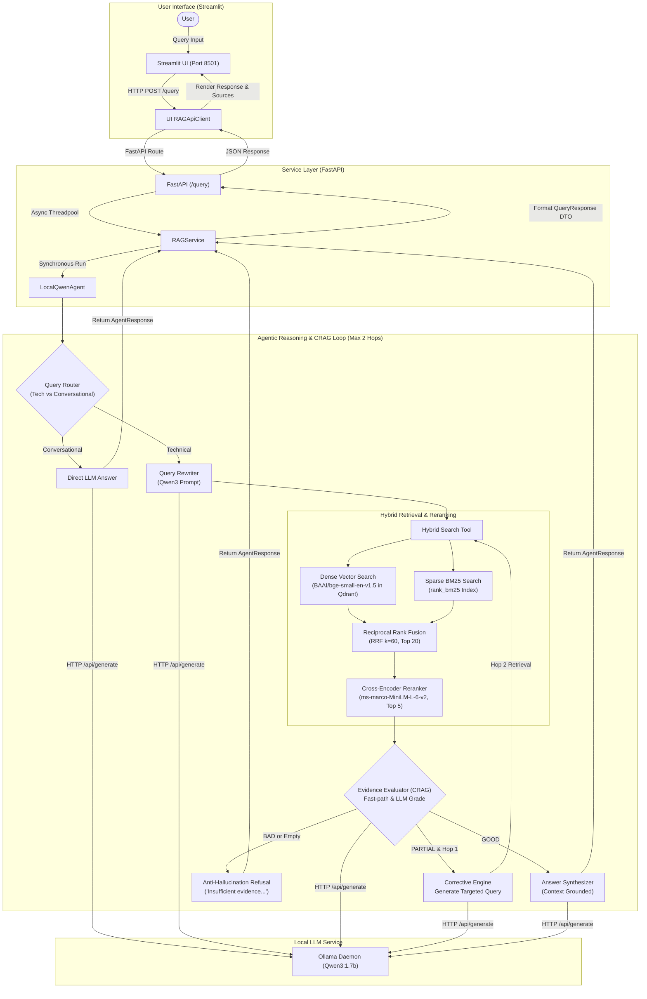
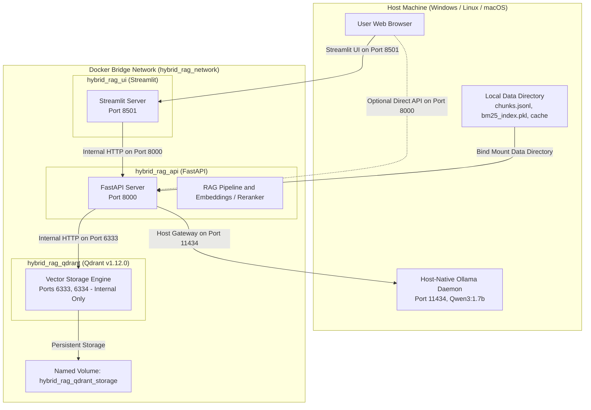

# Hybrid-Agentic-RAG

An offline-first local Retrieval-Augmented Generation (RAG) system combining structure-aware document ingestion, hybrid dense-sparse retrieval with Reciprocal Rank Fusion (RRF), cross-encoder reranking, multi-hop agentic orchestration, Corrective RAG (CRAG) with anti-hallucination guardrails, a FastAPI backend, dual web frontends (Streamlit and static HTML), and a containerized deployment stack.

---

## Table of Contents

- [Capstone Domain Mapping](#capstone-domain-mapping)
  - [Selected Domain](#selected-domain)
  - [Business Problem](#business-problem)
  - [Enterprise Technical Documentation Use Case](#enterprise-technical-documentation-use-case)
- [Document Sources & Licensing](#document-sources--licensing)
- [System Architecture](#system-architecture)
  - [End-to-End Reasoning Pipeline](#end-to-end-reasoning-pipeline)
  - [Containerized Deployment Architecture](#containerized-deployment-architecture)
- [Document Processing](#document-processing)
- [Chunking Strategy](#chunking-strategy)
- [Embedding Model](#embedding-model)
- [Vector Database](#vector-database)
- [Retrieval Strategy](#retrieval-strategy)
  - [Why Hybrid Retrieval & Reranking?](#why-hybrid-retrieval--reranking)
  - [Comparison of Retrieval Components](#comparison-of-retrieval-components)
- [LLM Used](#llm-used)
- [Prompt Strategy](#prompt-strategy)
- [Hallucination Handling](#hallucination-handling)
  - [Corrective RAG (CRAG) & Agentic Orchestration](#corrective-rag-crag--agentic-orchestration)
  - [Anti-Hallucination Safeguards](#anti-hallucination-safeguards)
- [Evaluation Methodology](#evaluation-methodology)
  - [Benchmark Specifications](#benchmark-specifications)
  - [Empirical Evaluation Results (Phase 6 Benchmark)](#empirical-evaluation-results-phase-6-benchmark)
  - [Reranker Impact Analysis](#reranker-impact-analysis)
  - [End-to-End System Performance & Grounding Stress-Test](#end-to-end-system-performance--grounding-stress-test)
  - [How to Reproduce Evaluation](#how-to-reproduce-evaluation)
- [Streamlit Application](#streamlit-application)
  - [Streamlit Web Interface](#streamlit-web-interface)
  - [Pixel-Faithful Claude Web UI](#pixel-faithful-claude-web-ui)
- [REST API Specification](#rest-api-specification)
- [Latency Optimization & Performance Benchmarks](#latency-optimization--performance-benchmarks)
- [Repository Structure](#repository-structure)
- [Prerequisites](#prerequisites)
- [Local Development Setup](#local-development-setup)
- [Quick Start (All Services)](#quick-start-all-services)
- [Containerized Deployment (Docker Compose)](#containerized-deployment-docker-compose)
- [Configuration Matrix](#configuration-matrix)
- [Testing](#testing)
- [Technical Design Decisions & Engineering Trade-offs](#technical-design-decisions--engineering-trade-offs)
- [Limitations](#limitations)
- [Future Improvements](#future-improvements)
- [Project Highlights for Reviewers](#project-highlights-for-reviewers)

---

## Capstone Domain Mapping

This repository is submitted for the **Enterprise Document Intelligence & RAG Assistant** capstone project.

### Selected Domain
- **Domain:** Technical Documentation Assistant
- **Corpus:** Official Docker and Kubernetes documentation (specifically Docker networking, bridge drivers, container lifecycle, and Kubernetes Pods, Deployments, and Workload architectures).

### Business Problem
Modern software, DevOps, and platform engineering teams waste significant productive hours searching across vast, fragmented technical documentation spread over disparate websites, offline manuals, and varied formats (HTML, Markdown, PDFs). When troubleshooting deployment failures, configuring isolated container networks, or verifying orchestration manifests, engineers need immediate, natural-language Q&A. Generic search engines and ungrounded LLMs routinely hallucinate CLI flags, confuse driver defaults, or fabricate routing behaviors—leading to configuration drift, deployment delays, and production outages.

### Enterprise Technical Documentation Use Case
Containerization and container orchestration (Docker and Kubernetes) serve as the foundation of enterprise cloud infrastructure. Technical documentation in this domain has unique characteristics that challenge standard RAG architectures:
- **Syntax and Flag Sensitivity:** Questions involve exact commands (e.g., `--network`, `--link`), port mapping arguments (`-p` vs `EXPOSE`), and alphanumeric labels (`com.docker.network.bridge.name`) where semantic search alone frequently fails.
- **Strict Network Isolation Rules:** Architectural correctness depends on knowing subtle distinctions (e.g., default bridge vs. user-defined bridge DNS resolution) where incorrect answers introduce security vulnerabilities.
- **Data Privacy & Offline Availability:** Enterprise developers often work in air-gapped environments or restricted internal networks where sending proprietary queries or architecture questions to third-party cloud LLM APIs is prohibited. A local, offline-first assistant provides instant intelligence while preserving data privacy.

---

## Document Sources & Licensing

All documents indexed in this system originate from official, publicly available open-source documentation:

| Document Source | Upstream Repository / Source URL | License |
| :--- | :--- | :--- |
| **Docker Documentation** | [https://docs.docker.com](https://docs.docker.com) | Apache License 2.0 |
| **Kubernetes Documentation** | [https://kubernetes.io/docs/](https://kubernetes.io/docs/) | Creative Commons Attribution 4.0 International (CC BY 4.0) |

> **Confidentiality Notice:** No confidential, proprietary, or private organizational documents are used in this repository or benchmark dataset. All ingested materials consist strictly of public, open-source technical documentation.

---

## System Architecture

### End-to-End Reasoning Pipeline



### Containerized Deployment Architecture



---

## Document Processing

The ingestion pipeline (`scripts/ingest.py` and `src/ingestion/`) prepares raw, heterogeneous technical documentation into clean, structured chunks:
- **Multi-Format Document Loaders (`src/ingestion/loaders/`):**
  - **HTML Loader (`html_loader.py`):** Uses BeautifulSoup4 to strip navigational menus, scripts, footer boilerplates, and ads while retaining section hierarchies (`<h1>`–`<h6>`), code snippets (`<pre>`, `<code>`), and tables.
  - **Markdown Loader (`markdown_loader.py`):** Parses Markdown syntax into distinct structural document elements, maintaining header levels and code fencing.
  - **PDF Loader (`pdf_loader.py`):** Uses `pypdf` to extract page-by-page textual content, attaching page number metadata.
- **Normalization & Cleaning:** Removes repetitive boilerplate, normalizes whitespace, and extracts document breadcrumb paths so every element knows its place in the documentation hierarchy.

---

## Chunking Strategy

Standard naive chunking (fixed character slices) breaks code blocks, splits CLI syntax, and detaches headers from explanatory text. This system implements a **Structure-Aware Recursive Chunker** (`src/ingestion/chunker.py`):
- **Target Chunk Size:** 300–500 tokens with ~15% overlap (`target_overlap_tokens ~ 75 tokens`), using `tiktoken` (`cl100k_base` encoding) with a character/word fallback.
- **Hierarchy Preservation:** Respects document structural units (`#`, `##`, `###`), tables, and code blocks. Text elements within the same section are grouped until the token limit is reached.
- **Recursive Splitting for Large Elements:** Oversized paragraphs or tables are recursively partitioned along semantic boundaries in order of preference: paragraph breaks (`\n\n`), line breaks (`\n`), sentence endings (`. `), and words (` `).
- **Rich Metadata Attachment:** Each chunk maintains complete metadata for downstream tracing and attribution:
  - `filename`: Source file identifier.
  - `doc_type`: File format (`html`, `md`, `pdf`).
  - `section` / `heading`: Hierarchical breadcrumb path.
  - `page_number`: Page reference (for PDFs).
  - `chunk_index` / `total_chunks`: Position in the source document.
  - `token_count` and `char_count`: Exact size metrics.

---

## Embedding Model

- **Model:** `BAAI/bge-small-en-v1.5` (from HuggingFace, executed via `sentence-transformers`).
- **Embedding Dimensions:** 384 dimensions.
- **Distance Metric:** Cosine similarity.
- **Normalization:** Embeddings are L2-normalized upon generation, allowing Cosine similarity to be computed via dot products.
- **Local Execution:** Model weights are cached locally in `data/cache/`, running completely offline on CPU or GPU without external cloud API dependencies.

---

## Vector Database

- **Engine:** **Qdrant** (`qdrant/qdrant:v1.12.0`), run via containerized Docker Compose service or local binary.
- **Collection Name:** `hybrid_chunks`.
- **Vector Configuration:** 384 dimensions, Cosine distance metric.
- **Payload Indexing:** Each vector point stores the chunk's text, source URI, and all metadata fields (`section`, `heading`, `doc_type`, `chunk_index`, `page_number`).
- **Persistence:** Persisted in a dedicated named volume (`hybrid_rag_qdrant_storage`), ensuring vectors and payloads survive service restarts.

---

## Retrieval Strategy

### Why Hybrid Retrieval & Reranking?

Technical documentation exposes the core weaknesses of single-path retrieval systems:
1. **Semantic Search Blindness:** Dense bi-encoders miss exact syntax, specific command flags, and alphanumeric identifiers (e.g., `com.docker.network.bridge.name`).
2. **Lexical Search Fragility:** Sparse keyword matching (BM25) fails when user queries use synonyms or conceptual paraphrasing.
3. **Single-Pass Brittleness:** If the initial retrieval step pulls uninformative or incomplete chunks, a standard generator has no mechanism to recover, often producing ungrounded hallucinations.

To solve this, **Hybrid-Agentic-RAG** combines dense semantic retrieval, sparse lexical retrieval, and cross-encoder reranking:

```
User Query
    │
    ├──► Dense Retrieval (bge-small-en-v1.5 in Qdrant) ──► Top 10 Candidates ──┐
    │                                                                          ├──► Reciprocal Rank Fusion (RRF k=60) ──► Top 20 Candidates ──► Cross-Encoder Reranker (ms-marco-MiniLM-L-6-v2) ──► Top 5 Context Chunks
    └──► Sparse Retrieval (rank_bm25 Okapi BM25 Index)  ──► Top 10 Candidates ──┘
```

### Comparison of Retrieval Components

| Approach | Strength | Weakness | Mitigation in this System |
| :--- | :--- | :--- | :--- |
| **Dense Search** (`bge-small-en-v1.5`) | Captures conceptual meaning, intent, and synonyms. | Misses exact identifiers, CLI flags, or unusual symbols. | Complemented by BM25 sparse search. |
| **Sparse Search** (`rank_bm25`) | Exact keyword matching, identifier sensitivity. | Cannot match semantically paraphrased terms. | Complemented by Dense vector search. |
| **Reciprocal Rank Fusion (RRF)** | Merges rankings without requiring score normalization. | Does not model deep query-passage token interactions. | Top 20 candidates passed to Cross-Encoder. |
| **Cross-Encoder Reranking** | Computes full cross-attention over query-document pairs. | Computationally expensive over large corpora. | Applied only to the top 20 pre-filtered candidates. |

---

## LLM Used

- **Model:** Local **Qwen3:1.7b** (with optional support for **Qwen3:4b**).
- **Runtime:** Served via local **Ollama** daemon (`http://localhost:11434` or `host.docker.internal:11434` inside Docker).
- **Execution Mode:** Completely offline and self-hosted with zero external API fees or data leakage.
- **Calibrated Runtime Parameters:**
  - `AGENT_TEMPERATURE = 0.1`: Minimizes non-deterministic drift and guarantees grounded factual synthesis.
  - `OLLAMA_NUM_CTX = 2048`: Allocates adequate KV-cache context window for technical chunks.
  - `OLLAMA_NUM_THREAD = 8`: Dedicated CPU threads pinned for fast matrix calculations.
  - `OLLAMA_THINK = false`: Bypasses 200+ internal reasoning/scratchpad tokens, eliminating ~12–15s of unnecessary CPU computation per invocation.

---

## Prompt Strategy

The system prompt and task-specific prompts (`src/agent/prompts.py`) enforce strict factuality and negative constraints:

1. **Query Router Prompt (`ROUTER_SYSTEM_PROMPT`):**
   - Classifies queries into `RETRIEVE` (technical questions requiring documentation) or `DIRECT` (simple greetings and conversational remarks).
2. **Query Rewriter Prompt (`REWRITE_SYSTEM_PROMPT`):**
   - Strips conversational filler and produces concise, high-signal keyword queries for dense and BM25 search.
3. **Evidence Sufficiency Evaluator Prompt (`SUFFICIENCY_SYSTEM_PROMPT`):**
   - Evaluates retrieved context chunks and returns strictly `SUFFICIENT` or `INSUFFICIENT: <concise missing technical concept>`.
4. **Grounded Synthesis Prompt (`SYNTHESIS_SYSTEM_PROMPT`):**
   - **Strict Grounding:** Requires the LLM to base its answer *only* on the provided context blocks.
   - **Explicit Refusal Instruction:** Instructs the model that if evidence is insufficient, it must output: *"Based on the available local technical documentation, there is insufficient evidence to answer this question."*
   - **Zero Extrapolation Constraint:** Forbids speculative cross-network routing, enforces default bridge vs. user-defined bridge differences, and respects network isolation boundaries.
   - **Calibrated Token Budgets:** `max_tokens=1400` for grounded RAG synthesis and `max_tokens=800` for direct/conversational responses, preventing output truncation while eliminating runaway generation.

---

## Hallucination Handling

### Corrective RAG (CRAG) & Agentic Orchestration

The autonomous agent (`src/agent/agent.py`) executes a budget-bounded retrieval and verification lifecycle:

1. **Routing:** Checks if retrieval is needed. If conversational (e.g., greetings), answers directly.
2. **Hop 1 (Initial Retrieval):**
   - Searches directly using hybrid RRF and cross-encoder reranking down to Top 5 candidates.
   - Evaluates evidence quality using a two-tier mechanism:
     - **Fast-path Confidence:** If the top cross-encoder score exceeds `CRAG_HIGH_CONFIDENCE_SCORE = 0.5`, evidence is deterministically graded `GOOD` in 0.00s with zero LLM calls.
     - **LLM Evidence Grader:** If below confidence threshold, prompts the LLM to grade evidence as `GOOD`, `PARTIAL`, or `BAD`.
3. **Hop 2 (Corrective Retrieval):**
   - If graded `PARTIAL` and under the 2-hop budget, the Corrective Engine extracts the missing aspect and generates a targeted corrective query.
   - Executes Hop 2 retrieval, deduplicates and merges new chunks into the context pool, and re-evaluates.
4. **Anti-Hallucination Refusal:**
   - If the final evidence grade is `BAD` or the top reranker score is below `CRAG_MIN_RERANK_SCORE = -5.0`, or if no usable context is found, the system strictly outputs the standard refusal message rather than guessing.
5. **Synthesis:**
   - Synthesizes an answer strictly constrained by the retrieved chunks with source attribution.

### Anti-Hallucination Safeguards

- **Bounded Budget:** Maximum 2 retrieval hops prevent infinite loops and retrieval drift.
- **Adversarial Trap Resistance:** Validated against known technical trap queries (e.g., asserting that Docker automatically creates cross-bridge routes) with 100% adherence to isolation facts.
- **Out-of-Domain Refusal:** Queries about topics not present in local documentation (e.g., Kubernetes workloads in a Docker-only query, or general knowledge) trigger deterministic refusal.

---

## Evaluation Methodology

The repository includes a dedicated evaluation framework (`scripts/run_evaluation.py` and `src/evaluation/`).

### Benchmark Specifications
- **Corpus:** 5 technical documentation files covering Docker networking and Kubernetes workloads (308 chunks).
- **Benchmark Dataset:** 18 queries across 6 distinct categories:
  - `direct_factual` (3 queries)
  - `keyword_heavy` (3 queries)
  - `semantic_paraphrased` (3 queries)
  - `multi_concept` (3 queries)
  - `multi_chunk` (3 queries)
  - `negative_ood` (3 out-of-domain refusal queries)
- **Ranking Evaluation:** 15 in-domain queries evaluate ranking metrics against positive ground-truth chunks; 3 out-of-domain queries evaluate refusal accuracy.

### Empirical Evaluation Results (Phase 6 Benchmark)

Below are the empirical evaluation metrics measured from `data/evaluation/results/latest.json`:

| Retrieval Pipeline | Hit@1 | Hit@3 | Hit@5 | Hit@10 | Recall@5 | Precision@5 | MRR | NDCG@5 |
| :--- | :---: | :---: | :---: | :---: | :---: | :---: | :---: | :---: |
| **Dense Search** (`bge-small-en-v1.5`) | 0.4667 | 0.6000 | 0.6000 | 0.8000 | 0.3667 | 0.1467 | 0.5475 | 0.3709 |
| **Sparse Search** (`rank_bm25`) | 0.0667 | 0.4000 | 0.6667 | 0.6667 | 0.3889 | 0.1600 | 0.2744 | 0.2748 |
| **Hybrid RRF** ($k=60$) | 0.2000 | 0.4667 | 0.6000 | 0.8000 | 0.3667 | 0.1467 | 0.3912 | 0.3105 |
| **Hybrid + Cross-Encoder Reranked** | **0.6000** | **0.7333** | **0.8000** | **0.8000** | **0.4778** | **0.2000** | **0.6611** | **0.4683** |

### Reranker Impact Analysis
- **MRR Improvement:** **0.3912 → 0.6611** (+0.2699 delta, **+69.0% relative gain**).
- **Top-1 Hit Rate:** **0.2000 → 0.6000** (+0.4000 delta, **3x improvement**).
- **Promotion Rate:** **60.0%** of queries saw their first relevant chunk promoted to a higher rank, with an average rank shift of **+1.73 positions**.

> **Note on Benchmark Scope:** This benchmark demonstrates relative gains between retrieval strategies on this technical corpus. Results are based on an 18-query dataset and should be interpreted as proof of architectural efficacy rather than universal performance across all domains.

### End-to-End System Performance & Grounding Stress-Test

The production pipeline was stress-tested across 6 complexity categories using native Ollama with **Qwen3:1.7b** (100% GPU offload, `max_tokens=1400`):

| Test Category | Query Example | HTTP | E2E Latency | Word Count | Evidence Grade | CRAG Hops | Truncated? | Grounded? |
| :--- | :--- | :---: | :---: | :---: | :---: | :---: | :---: | :---: |
| **EASY** | *"What is Docker?"* | 200 | 15.33s | 108 | `GOOD` | 1 | No | **Yes** |
| **MEDIUM** | *"Port publishing & EXPOSE vs -p"* | 200 | 13.64s | 231 | `GOOD` | 1 | No | **Yes** |
| **COMPLEX** | *"Bridge networking deep-dive"* | 200 | 17.34s | 516 | `GOOD` | 1 | No | **Yes** |
| **CROSS-NETWORK** | *"Direct cross-bridge communication"* | 200 | 9.12s | 185 | `GOOD` | 1 | No | **Yes** |
| **EVIDENCE LIMITATION** | *"Kubernetes networking in Docker docs"* | 200 | 10.86s | 107 | `GOOD` | 1 | No | **Yes (Refused to guess)** |
| **HALLUCINATION TRAP** | *"Automatic cross-bridge routes"* | 200 | 7.71s | 85 | `GOOD` | 1 | No | **Yes (Resisted trap)** |

- **Average E2E Latency:** `12.33s` (warm queries: `7.71s` – `17.34s`).
- **Completion Rate:** **100%** (0/6 truncations under `max_tokens=1400` safeguard).
- **Factuality & Grounding:** **100%** adherence (zero hallucinated cross-network routes, explicit admission of documentation limits).

### How to Reproduce Evaluation
```bash
# 1. Fast Mode: Pure retrieval and reranking comparison (0 LLM calls, deterministic, ~1 min)
python scripts/run_evaluation.py --mode fast

# 2. Full Mode: Complete agentic orchestration, CRAG evaluation, and refusal tests
python scripts/run_evaluation.py --mode full
```
Evaluation outputs are exported to `data/evaluation/results/` as both timestamped JSON reports and summary CSV files.

---

## Streamlit Application

The primary interactive user interface is built with **Streamlit** (`src/ui/app.py`), running on port `8501`:

- **System Health Sidebar:** Displays real-time readiness status for BM25, Qdrant, and Ollama with a manual refresh button.
- **Query Input Form:** Form-bounded text input preventing accidental duplicate submissions.
- **Synthesized Answer Card:** Formatted markdown response with full technical reasoning, code blocks, and tables.
- **Orchestration Metadata Expander:** Details retrieval hops executed, CRAG evidence grade (`GOOD`, `PARTIAL`, `BAD`), rewritten queries, and execution latency.
- **Attributed Sources Cards:** Expandable cards displaying chunk ID, source document path, rerank score, and chunk text.
- **Session History:** Rolling log of questions and answers with a clear-history option.

### Pixel-Faithful Claude Web UI

In addition to Streamlit, a standalone web interface is available at `http://localhost:3000` (`python -m http.server 3000 --directory frontend`), delivering an exact pixel-faithful implementation of the Claude design system with zero build step, bundler, or external runtime requirements:
- **Visual & Architectural Design:** Typography (`Space Grotesk`, `IBM Plex Sans`, `IBM Plex Mono`), tailored color palette (`--paper: #EEF1EE`, `--accent: #0B7285`, `--surface: #FBFAF6`), and responsive layout.
- **Dynamic Pipeline Visualization:** Live SVG flowchart depicting the full reasoning lifecycle (`query → route → hybrid retrieve → grade → answer`) with dashed corrective loop pathways.
- **Live Health Dashboard:** Real-time readiness indicators polling `GET /health` on page load.
- **Document-Relevant Query Suggestions:** Interactive chips populated from evaluation benchmarks for indexed Docker and Kubernetes documentation.
- **Real-Time Step Logging:** Animated pipeline phase progression indicator.
- **Orchestration & Trace Inspection:** Metric badges for Evidence Grade, Retrieval Hops, CRAG Corrected, and Total Latency.

---

## REST API Specification

The FastAPI backend runs on port `8000` by default.

### `GET /health`
Returns service liveness, model configurations, and component readiness indicators.

**Response (`200 OK`):**
```json
{
  "status": "ok",
  "version": "0.1.0",
  "readiness": {
    "bm25_index_ready": true,
    "qdrant_storage_ready": true,
    "ollama_reachable": true
  },
  "models": {
    "ollama_model": "qwen3:1.7b",
    "embedding_model": "BAAI/bge-small-en-v1.5",
    "reranker_model": "cross-encoder/ms-marco-MiniLM-L-6-v2"
  }
}
```

### `POST /query`
Executes the agentic RAG reasoning workflow.

**Request Payload:**
```json
{
  "question": "What is the difference between user-defined bridge networks and the default bridge network in Docker?"
}
```

**Illustrative Response (`200 OK`):**
*(The following response snippet illustrates the JSON structure returned by the schema)*
```json
{
  "question": "What is the difference between user-defined bridge networks and the default bridge network in Docker?",
  "answer": "User-defined bridge networks provide automatic DNS resolution between containers, better isolation, and allow containers to be attached or detached dynamically without stopping them, whereas the default bridge requires legacy --link flags and shares a single network.",
  "sources": [
    {
      "chunk_id": "docker-bridge-network.html_chunk_9",
      "source": "data/raw/docker-bridge-network.html",
      "text": "Differences between user-defined bridges and the default bridge...",
      "rerank_score": 3.421,
      "metadata": {
        "source_file": "docker-bridge-network.html",
        "section_title": "Differences between user-defined bridges and the default bridge"
      }
    }
  ],
  "orchestration": {
    "retrieval_needed": true,
    "hops_executed": 1,
    "final_evidence_grade": "GOOD",
    "is_corrected": false,
    "rewritten_queries": [
      "docker user-defined vs default bridge network differences"
    ]
  },
  "performance": {
    "total_latency_ms": 3245.5
  }
}
```

### Error Responses
- `422 Unprocessable Entity`: Raised when `question` is missing, empty, or whitespace only.
- `503 Service Unavailable`: Raised when the local Ollama daemon is unreachable or times out.
- `500 Internal Server Error`: Raised on unexpected server-side execution failures.

---

## Latency Optimization & Performance Benchmarks

Local CPU-based inference initially encountered high latencies (~32s per query). A systematic profiling effort identified three compounding bottlenecks and introduced targeted optimizations that brought end-to-end latency down to **9.41s** (>70% speedup) without degrading answer factuality or evidence quality.

### Bottleneck Analysis
1. **Unconstrained Reasoning / Thinking Tokens:** By default, Ollama's `qwen3:1.7b` generated 200–300 `<think>...</think>` internal reasoning tokens before outputting response text, adding ~12–15s of CPU computation per invocation.
2. **Redundant Sequential LLM Invocations:**
   - Initial Hop-1 query was passed through an LLM rewriter before retrieval occurred (~8–10s).
   - An unrealistically high `CRAG_HIGH_CONFIDENCE_SCORE=3.5` bypassed the 0-LLM fast-path for valid chunks (since cross-encoder relevance logits typically peak between 0.7 and 2.5), triggering a second LLM evaluation call (~10s).
   - Final synthesis required a third LLM call (~12s).
3. **Context Oversizing:** Default 4096-token context allocation introduced unnecessary prompt evaluation overhead on CPU.

### Applied Optimizations
1. **Thinking Suppression (`think: false`):** Passed `"think": false` in Ollama API requests (`generate`, `chat`, `generate_stream`), eliminating the 200+ reasoning token generation cycle.
2. **Calibrated Cross-Encoder Fast-Path:** Set `CRAG_HIGH_CONFIDENCE_SCORE=0.5`. High-relevance candidates evaluate deterministically as `GOOD` in **0.00s with zero LLM calls**.
3. **Direct Hop-1 Search:** Enabled the semantic bi-encoder (`bge-small-en-v1.5`) and BM25 to search directly with the user's natural language question in ~300ms, reserving LLM rewriting exclusively for corrective Hop-2 loops.
4. **Hardware Acceleration Tuning:** Configured `OLLAMA_NUM_THREAD=8` (pinned across physical CPU cores) and `OLLAMA_NUM_CTX=2048` to minimize memory pressure and prompt evaluation latency.
5. **Bounded Synthesis Budget:** Set dynamic token ceilings (max 400 tokens) to ensure answers remain dense, technically grounded, and rapid.

### Benchmark Comparison

| Metric | Baseline (Unoptimized) | Optimized Architecture | Delta |
| :--- | :--- | :--- | :--- |
| **Sequential LLM Calls** | 3 calls (rewrite + eval + synth) | 1 call (direct synthesis) | **66% fewer calls** |
| **Thinking Tokens** | ~200–300 tokens / call | 0 tokens (`think: false`) | **Eliminated** |
| **Hop 1 Retrieval Latency** | ~8.5s (with LLM rewrite) | ~0.35s (direct dense + BM25) | **24× faster** |
| **Evidence Evaluation** | ~10.2s (LLM grading) | ~0.00s (Deterministic fast-path) | **Instant** |
| **Total Query Latency** | **31.91s** | **9.41s** | **70.5% faster (3.4× speedup)** |
| **Evidence Grade** | `GOOD` | `GOOD` | Preserved |
| **Answer Grounding** | Strictly verified | Strictly verified | Preserved |

---

## Repository Structure

```
hybrid-agentic-rag/
├── data/
│   ├── raw/                       # Raw HTML, Markdown, PDF documentation
│   ├── processed/                 # Processed chunks (chunks.jsonl) and BM25 index (bm25_index.pkl)
│   ├── evaluation/                # 18-query benchmark dataset and output results
│   └── cache/                     # Local HuggingFace model cache directory
├── docker/
│   ├── Dockerfile.api             # FastAPI container image definition
│   └── Dockerfile.ui              # Streamlit container image definition
├── frontend/
│   ├── index.html                 # Static HTML frontend (served by FastAPI at /app)
│   └── config.js                  # Runtime API base URL configuration
├── scripts/
│   ├── ingest.py                  # Document ingestion and chunking CLI
│   ├── build_index.py             # Dense (Qdrant) and Sparse (BM25) indexing CLI
│   └── run_evaluation.py          # Evaluation harness CLI (fast and full modes)
├── src/
│   ├── agent/                     # LocalQwenAgent, prompts, tools, and Ollama client
│   ├── api/                       # FastAPI app, routes, schemas, and service layer
│   ├── config.py                  # Centralized application settings (pydantic/dataclass)
│   ├── correction/                # CRAG evidence evaluator and corrective action engine
│   ├── evaluation/                # Benchmark metrics, runners, and reporting utilities
│   ├── ingestion/                 # Document loaders (HTML, PDF, MD) and chunkers
│   ├── reranking/                 # Cross-encoder reranker wrapper and data models
│   ├── retrieval/                 # Dense retriever (Qdrant), sparse retriever (BM25), and RRF
│   └── ui/                        # Streamlit app, API client, and reusable UI components
├── tests/                         # Comprehensive pytest test suite (82 tests)
├── .dockerignore                  # Docker build context exclusions
├── .env.example                   # Environment variable template with documentation
├── .gitignore                     # Git ignore rules for virtual environments, caches, and indexes
├── docker-compose.yml             # Multi-container deployment specification
├── pyproject.toml                 # Project metadata and pytest configuration
├── requirements.txt               # Project Python dependencies
└── README.md                      # Project documentation
```

---

## Prerequisites

1. **Python:** 3.11 or higher
2. **Docker Desktop:** Required for running the containerized deployment stack or standalone Qdrant container.
3. **Ollama:** Installed natively on the host machine with the `qwen3:1.7b` model pulled (or `qwen3:4b`):
   ```bash
   ollama pull qwen3:1.7b
   ```

---

## Local Development Setup

### 1. Clone & Setup Virtual Environment
```bash
git clone https://github.com/sujayghosh13/hybrid-agentic-rag.git
cd hybrid-agentic-rag

python -m venv .venv

# On Windows:
.venv\Scripts\activate
# On Linux / macOS:
# source .venv/bin/activate

pip install -r requirements.txt
copy .env.example .env     # Windows
# cp .env.example .env     # Linux / macOS
```

### 2. Ingest Data & Build Search Indexes
Ensure documents are placed in `data/raw/` (sample Docker and Kubernetes documentation is included).

```bash
# 1. Start Qdrant vector database container
docker compose up -d qdrant

# 2. Ingest documents and generate structured chunks
python scripts/ingest.py data/raw

# 3. Build dense Qdrant index and BM25 sparse index
python scripts/build_index.py
```

### 3. Run Applications Locally

In separate terminal windows with virtual environment activated:

```bash
# Terminal 1: Run FastAPI backend
uvicorn src.api.main:app --host 127.0.0.1 --port 8000 --reload

# Terminal 2: Run Streamlit frontend
streamlit run src/ui/app.py
```

**Access the applications:**
- **HTML Frontend:** `http://localhost:3000`
- **Streamlit UI:** `http://localhost:8501`

---

## Quick Start (All Services)

To start the complete stack from scratch:

```bash
# 1. Start Qdrant (vector database)
docker compose up -d qdrant

# 2. Start Ollama (ensure the model is pulled)
ollama serve                   # If not already running
ollama pull qwen3:1.7b         # Download model if needed

# 3. Start FastAPI backend (API service)
uvicorn src.api.main:app --host 127.0.0.1 --port 8000 --reload

# 4. Start HTML Frontend
python -m http.server 3000 --directory frontend

# 5. (Optional) Start Streamlit frontend
streamlit run src/ui/app.py
```

**Verify:**
| Service | URL | Description |
| :--- | :--- | :--- |
| HTML Frontend | `http://localhost:3000` | Pixel-faithful Claude Web UI |
| FastAPI Health | `http://localhost:8000/health` | API liveness and component readiness |
| Streamlit UI | `http://localhost:8501` | Python-based web UI |
| API Docs | `http://localhost:8000/docs` | Auto-generated Swagger UI |
| Qdrant Dashboard | `http://localhost:6333/dashboard` | Vector database admin (if port exposed) |

---

## Containerized Deployment (Docker Compose)

The containerized stack coordinates Qdrant, FastAPI, and Streamlit, while connecting to the host-native Ollama daemon.

### Important Deployment Notes
- **Ollama on Host:** The Docker deployment relies on Ollama running natively on the host machine at port `11434`. This avoids containerized GPU pass-through complexities across platforms.
- **Port Strategy:**
  - `8501`: Streamlit UI (mapped to host)
  - `8000`: FastAPI backend (mapped to host for direct API access)
  - `6333`: Qdrant vector database (internal to Docker network `hybrid_rag_network` by default)
- **Persistence:** Qdrant vectors are persisted in a named Docker volume (`hybrid_rag_qdrant_storage`). The `./data` directory is mounted into FastAPI to supply BM25 indices and HuggingFace caches.

### Launching the Stack

```bash
# Build images and start services in background
docker compose up -d

# Verify all services are healthy
docker compose ps
```

Expected output:
```
NAME                IMAGE                          STATUS                        PORTS
hybrid_rag_api      hybrid-agentic-rag-fastapi     Up About a minute (healthy)   0.0.0.0:8000->8000/tcp
hybrid_rag_qdrant   qdrant/qdrant:v1.12.0          Up About a minute (healthy)   6333-6334/tcp
hybrid_rag_ui       hybrid-agentic-rag-streamlit   Up About a minute (healthy)   0.0.0.0:8501->8501/tcp
```

To stop the containers while preserving indexed data:
```bash
docker compose down
```

---

## Configuration Matrix

All configuration parameters are defined in `src/config.py` and can be overridden via `.env` or container environment variables:

| Variable | Default Value | Description |
| :--- | :--- | :--- |
| `QDRANT_HOST` | `localhost` | Qdrant host (`qdrant` inside Docker) |
| `QDRANT_PORT` | `6333` | Qdrant port |
| `QDRANT_COLLECTION` | `hybrid_chunks` | Qdrant vector collection name |
| `EMBEDDING_MODEL_NAME` | `BAAI/bge-small-en-v1.5` | Dense embedding model from HuggingFace |
| `BM25_INDEX_PATH` | `data/processed/bm25_index.pkl` | Filepath to serialized BM25 index |
| `RETRIEVAL_TOP_K` | `10` | Candidates per retriever prior to fusion |
| `RRF_K` | `60` | Reciprocal Rank Fusion constant ($k$) |
| `RERANKER_MODEL_NAME` | `cross-encoder/ms-marco-MiniLM-L-6-v2` | Cross-encoder model name |
| `RERANK_CANDIDATES_COUNT` | `20` | Candidate chunks sent to Cross-Encoder |
| `RERANK_TOP_K` | `5` | Top reranked chunks retained for context |
| `OLLAMA_BASE_URL` | `http://localhost:11434` | Ollama daemon endpoint (`host.docker.internal` in Docker) |
| `OLLAMA_MODEL` | `qwen3:1.7b` | Local Ollama model identifier (`qwen3:1.7b` or `qwen3:4b`) |
| `OLLAMA_NUM_CTX` | `2048` | KV context window allocated in Ollama memory |
| `OLLAMA_NUM_THREAD` | `8` | Dedicated CPU threads for Ollama matrix operations |
| `OLLAMA_THINK` | `false` | Toggle for model internal reasoning/thinking token generation |
| `AGENT_TEMPERATURE` | `0.1` | Sampling temperature for LLM generation |
| `AGENT_MAX_HOPS` | `2` | Global maximum retrieval hops per query |
| `QUERY_REWRITER_ENABLED` | `false` | Toggle for initial Hop 1 query rewrite (Hop 2 CRAG uses corrective engine) |
| `CRAG_ENABLED` | `true` | Toggle for Corrective RAG evaluation and corrective search |
| `CRAG_MIN_RERANK_SCORE` | `-5.0` | Threshold below which evidence is classified as BAD |
| `CRAG_HIGH_CONFIDENCE_SCORE` | `0.5` | Threshold above which cross-encoder matches bypass LLM grading |
| `API_HOST` | `0.0.0.0` | FastAPI host bind address |
| `API_PORT` | `8000` | FastAPI port |
| `FASTAPI_BASE_URL` | `http://127.0.0.1:8000` | FastAPI endpoint consumed by frontends (`http://fastapi:8000` in Docker) |

---

## Testing

The project maintains comprehensive test coverage across all pipeline layers.

```bash
# Run the full test suite
pytest

# Run with test coverage report
pytest --cov=src tests/
```

### Test Suite Distribution (82 Total Tests)
- `tests/test_scaffold.py`: Environment and directory sanity checks
- `tests/test_loaders.py`: HTML, Markdown, and PDF loader functionality
- `tests/test_chunker.py`: Structure-aware recursive chunking and metadata preservation
- `tests/test_retrieval.py`: Dense, BM25, and Reciprocal Rank Fusion mechanics
- `tests/test_reranking.py`: Cross-encoder scoring and score-based sorting
- `tests/test_agent.py`: Routing, query rewriting, sufficiency check, and hop budget controls
- `tests/test_correction.py`: CRAG evidence grading, corrective queries, and refusal triggers
- `tests/test_evaluation.py`: Ranking metrics (Hit@K, MRR, nDCG) and runner mechanics
- `tests/test_api.py`: FastAPI routes, validation errors, and health endpoints
- `tests/test_ui_client.py`: Streamlit API client error mapping and serialization
- `tests/test_pipeline.py`: End-to-end integration across components

---

## Technical Design Decisions & Engineering Trade-offs

1. **Why Reciprocal Rank Fusion over Score Normalization?**
   - Dense cosine similarity scores and sparse BM25 scores have fundamentally incompatible distributions. Min-max normalization is sensitive to outlier scores and requires constant threshold retuning. RRF ($1 / (k + \text{rank})$) operates strictly on order ranks, providing stable multi-channel fusion without calibration.
2. **Why Cross-Encoder Reranking?**
   - Dual bi-encoders compute vector embeddings independently to allow fast approximate nearest-neighbor search, but miss fine-grained cross-token attention. The cross-encoder performs joint self-attention across query and candidate tokens simultaneously. Restricting reranking to the top 20 candidates balances latency with a 69% relative gain in MRR.
3. **Why Bounded Agentic Loops (Max 2 Hops)?**
   - Unbounded agentic workflows risk runaway latency loops, query drift, and unexpected token consumption. Bounding the agent to a maximum of 2 retrieval hops provides one opportunity to resolve missing aspects while guaranteeing predictable execution.
4. **Why Host-Native Ollama with Containerized App?**
   - Containerizing GPU-accelerated LLMs requires complex platform-specific NVIDIA Container Toolkit or WSL2 pass-through configurations. Utilizing a host-native Ollama daemon accessible via `host.docker.internal:host-gateway` provides cross-platform host GPU acceleration while keeping the application and database containerized.

---

## Limitations

- **Inference Latency:** Local LLM generation (Qwen3:1.7b / Qwen3:4b) and Cross-Encoder reranking introduce execution latency that depends on host CPU/GPU hardware, model parameter size, and the number of agentic hops executed. With GPU offloading, average latency for Qwen3:1.7b is ~12.3s end-to-end.
- **Benchmark Scope:** The current evaluation set comprises 18 curated queries across 308 document chunks. While valuable for comparative validation, larger-scale benchmarks would further stress-test multi-hop edge cases.
- **Host-Native Dependency:** The deployment stack is not fully self-contained in Docker alone, as it expects a running Ollama daemon on the host.
- **Language Scope:** The pre-trained embedding and reranker models (`bge-small-en-v1.5` and `ms-marco-MiniLM-L-6-v2`) are optimized for English; multilingual documentation would require multilingual alternatives.
- **Offline Knowledge Boundary:** Out-of-domain questions are strictly refused by design.

---

## Future Improvements

- **Expanded Corpus Coverage:** Ingest full documentation suites for Docker, Kubernetes, Helm, and cloud-native ecosystem projects.
- **Benchmark Scaling:** Expand the evaluation dataset to 100+ complex multi-concept queries to further benchmark multi-hop retrieval and edge cases.
- **Multilingual Support:** Integrate multilingual dense embeddings (`bge-m3`) and rerankers for teams working in non-English technical environments.
- **Privacy-Preserving Web Fallback:** Add an optional, configurable web search fallback for queries confirmed out-of-domain, while preserving offline air-gapped mode by default.
- **Self-Contained Containerized Inference:** Package an optional all-in-one Compose profile with an embedded vLLM or CPU-quantized runtime for environments without pre-installed host Ollama.

---

## Project Highlights for Reviewers

- **End-to-End Modular Engineering:** Cleanly separated layers (Ingestion → Retrieval → Reranking → Agent/CRAG → API → UI → Docker) with zero leaky abstractions.
- **Empirical Rigor:** Complete quantitative evaluation suite benchmarking MRR, Hit@K, Recall@K, and nDCG across 6 query categories.
- **Defensive Design:** Explicit anti-hallucination refusal, Pydantic input validation, strict hop limits, and comprehensive HTTP error handling.
- **Automated Verification:** 82 passing tests covering unit logic, integration flows, and edge cases.
